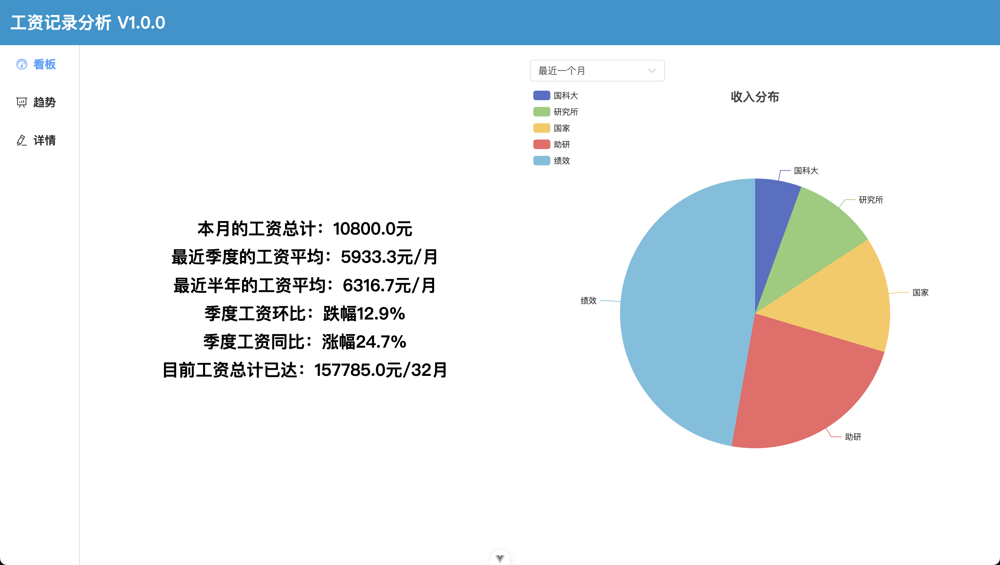
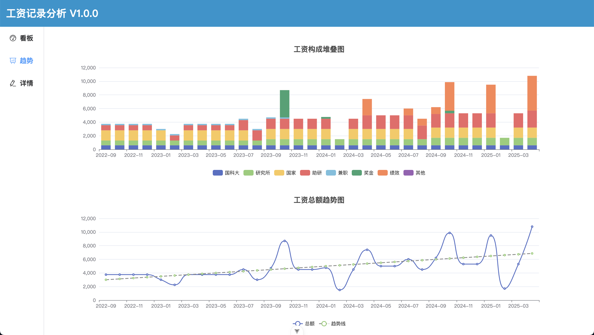
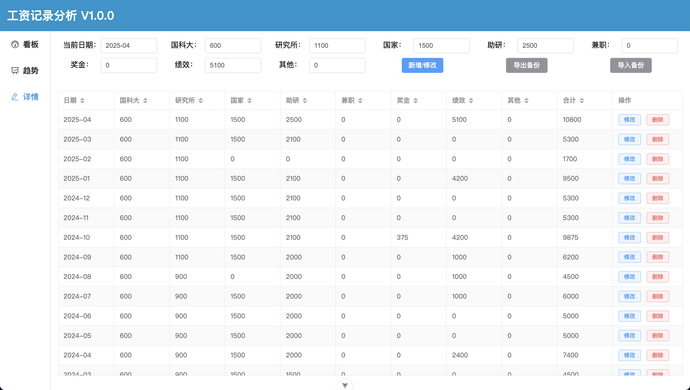

# 国科大工资记录可视化

🎓 **国科大工资记录可视化** 是一款专为中国科学院大学（UCAS）同学打造的工资记录与趋势分析工具，帮助你轻松管理每月工资构成，洞察收入变化趋势，做自己的财务管家！

## ✨ 项目亮点

- **纯前端应用**：无后端、无服务器，所有数据本地存储，数据安全无忧。
- **多维度可视化**：工资构成、趋势、同比环比，一目了然。
- **数据自主可控**：数据导入导出，支持多端备份、迁移。
- **极致隐私**：所有工资数据仅保存在你的浏览器本地 `localStorage`，绝不上传，放心使用！

---

## 🖼️ 核心功能

### 1. 看板

<div align="center">

</div>

- 查看**本月工资**、**最近季度/半年工资**
- 轻松掌握**季度环比、同比变化**
- **累计收入**总览
- **饼图**展示各阶段工资构成

### 2. 趋势

<div align="center">

</div>

- **堆叠柱状图**：直观展示每月工资各构成项变化
- **折线图+趋势拟合**：洞察工资总额走势，把握未来趋势

### 3. 详情

<div align="center">

</div>


- 支持**国科大、研究所、国家、助研、兼职、奖金、绩效、其他**多种工资来源
- 每月数据**增/删/改/查**
- 支持多种工资子项排序
- 一键**导入/导出 JSON 数据**，备份无忧

---

## 🚀 快速开始

### 1. 在线体验

[👉 立即体验](https://witty-sky-061647210.6.azurestaticapps.net)

### 2. 自行部署

#### 方案一：Fork & 静态部署

- Fork 本仓库
- 使用 [Azure Static Web Apps](https://azure.microsoft.com/zh-cn/products/app-service/static/) 或 [Vercel](https://vercel.com/) 等服务，一键部署

#### 方案二：本地开发

```bash
# 克隆项目
git clone https://github.com/KarlRaphel/ucas-salary-viz.git
cd ucas-salary-viz

# 安装依赖
npm install

# 启动本地开发环境
npm run dev

# 构建生产环境静态文件
npm run build
# 部署 dist 目录到任意静态服务器（如 nginx）
```

#### 方案三：Docker 部署

```bash
# 构建镜像
docker build -t salary-viz .

# 使用 docker-compose 部署
docker-compose up -d
```

---

## ⚡ 数据安全说明

- **本地存储**：所有工资数据仅存储在本地浏览器 `localStorage`，不会上传至任何服务器。你可以使用 `F12` 打开开发者工具，在 `Application` > `Local Storage` 查看数据。
- **隐私保障**：纯前端架构，代码开源，可自行部署，无后端通信，杜绝数据泄露风险。
- **数据导出/导入**：支持一键导出/导入 JSON，便于自行备份与迁移。

---

## 📝 使用说明

1. **添加工资数据**：在详情界面，按月添加各项工资来源。
2. **查看可视化数据**：在看板和趋势界面，实时掌握工资构成与变化。
3. **数据导入导出**：在详情界面，导出数据进行备份，或导入恢复历史记录。

---

## 💡 适用场景

- 国科大学生、科研工作者、兼职/助研人员
- 需要对工资收入构成、趋势进行精细管理和分析的你

---

## 🙌 参与贡献

欢迎提出建议、反馈 bug，或 PR 你的改进！

---

## 📄 许可证

MIT License

---

**让工资一目了然，做更懂生活的你！**

如需进一步美化或补充细节，欢迎随时告知！